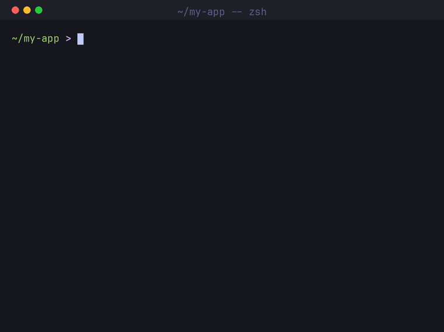

# SlopMD

**The markdown doctor for AI-written code.**

[](https://www.npmjs.com/package/slopmd)
[](#why-an-agent-finds-what-a-linter-cannot)
[](package.json)
[](package.json)
[](LICENSE)

Your coding agent writes slop: narrated comments, wrapper classes around nothing, swallowed exceptions, `any` casts, emoji in logs, hallucinated packages, secrets in source. SlopMD diagnoses it, treats it, and prevents it.

Works with Claude Code, Cursor, Codex, Copilot, Windsurf, Gemini CLI, and any agent that speaks [Agent Skills](https://agentskills.io).

```
npx slopmd
```

Ten seconds, no install, no config: a lab scan of your repo and a **Slop Score** out of 100.



That output is real, not a mockup:

```
SLOPMD LAB RESULTS
==================

Scanned 4 files, 27 lines of code.

CRITICAL (1)
  hardcoded-secret
    src/api/client.ts:2  Possible hardcoded API secret key

HIGH (4)
  unpinned-dependency
    package.json:4  Unpinned dependency express: "^4.18.0"
    package.json:5  Unpinned dependency axios: "~1.6.0"
    package.json:6  Unpinned dependency lodash: "latest"
  broad-catch
    src/utils/retry.ts:5  Empty catch block swallows errors

MEDIUM (3)
  type-suppression
    src/api/client.ts:6  any defeats type checking
  debug-leftover
    src/auth.ts:4  console.log/debug left outside test or CLI code
  ai-tell-comment
    src/utils/retry.ts:1  AI filler phrase: "in a real app"

LOW (1)
  narration-comment
    src/auth.ts:2  Comment narrates the next line ("increment ...")

Summary: 1 critical, 4 high, 3 medium, 1 low (9 total)

SLOP SCORE: 33/100 (Critical condition)
```

## The clinical arc

| Step | What happens |
|---|---|
| **Diagnose** | Lab scan (deterministic, 16 rules) plus a guideline-based examination by your agent. Output: Symptoms, Diagnosis, Prescription, Prognosis. |
| **Treat** | Your agent applies the prescription: one intent per diff, verified after every change, judgment calls proposed before applied. |
| **Prevent** | Prime directives installed into your agents' rules, so the slop never gets written. About 650 tokens, always on. |
| **Check-dep** | Trust triage before any new dependency: registry existence, age, downloads, OSV vulnerabilities, typosquatting distance. Verdict: trusted, caution, or requires approval. |

## Install

Into your coding agents (Claude Code, Cursor, Codex, Copilot, and ~70 others), via the [skills CLI](https://github.com/vercel-labs/skills):

```
npx skills add flopeztancredi/slopmd
```

The prevention layer (always-on rules for every agent detected in your repo or on your machine):

```
npx slopmd init
```

Then, inside your agent: "run a slop diagnosis on this repo", or "check my changes for slop before I commit".

## Why an agent finds what a linter cannot

The lab scanner catches the objective slop: secrets, emoji, em-dashes, unpinned versions, bare excepts, debug leftovers. But the worst slop is structural: the wrapper class that hides nothing, the helper duplicating one that already exists two directories away, business logic pasted into a route handler, the test that asserts its own mock. That takes judgment, and judgment needs guidelines.

SlopMD's examination guidelines distill the canon: Ousterhout's *A Philosophy of Software Design*, *Clean Code*, *The Pragmatic Programmer*, Fowler's *Refactoring*, *Code Complete*, GoF, DDD, the Google style guides, OWASP, and 12-factor, into 12 categories of imperative, sourced rules. Where the sources disagree, we take a position: functions split on subproblems, not line counts; narration comments are banned and interface contracts are mandatory. Every clinical finding carries a confidence score, and anything under 80 stays out of the report. Local project convention always wins over the guidelines.

## Dependency trust

About 20 percent of packages suggested by LLMs do not exist, and attackers register the hallucinated names ([slopsquatting](https://snyk.io/articles/slopsquatting-mitigation-strategies/)). Before your agent adds anything:

```
npx slopmd check-dep left-pad
npx slopmd check-dep requests --eco pypi
```

Exit code 0 means proceed (pinned exact). 1 means caution, justify it. 2 means stop and ask a human. Agents installed with SlopMD obey these codes automatically.

## CI

Run diff-only in CI:

```
npx slopmd --diff origin/main --fail-under 80
```

Your build fails on slop the change introduced, never on the backlog you inherited.

## Suppressing a finding

Add `slopmd-ignore` in a comment on or above the line. Use it for the exceptions that prove the rule, not as a lifestyle.

## Configuration

None required. `magic-number` already allows HTTP status codes, common time constants, and powers of two, so `404` and `32` do not get reported as unnamed.

For numbers that are self-describing in *your* domain, add an optional `.slopmd.json` at the repo root:

```json
{
  "magic-number": {
    "ignore": [7350, 999]
  }
}
```

These are added to the built-in defaults, never replace them. `86400000` buried in a business calculation is still a finding, which is where the rule earns its keep.

## Token budget

Skills load progressively per the Agent Skills spec: ~100 tokens of metadata per skill at rest, the skill body only when invoked, and each guideline category only when the examination needs it. The always-on prevention layer is ~650 tokens. Your context is treated like the scarce resource it is.

## License

MIT
